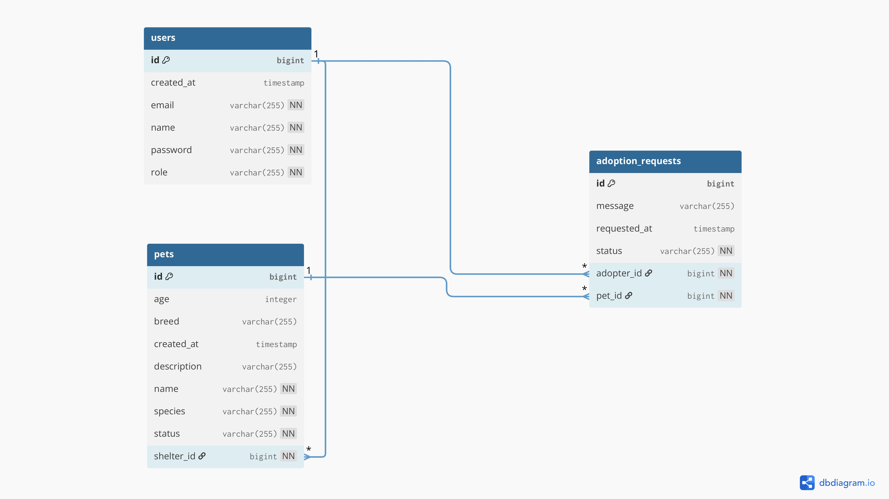

# 🐾 Home4Paws

A pet adoption platform backend built with **Spring Boot**, **PostgreSQL**, **JPA**, and **Hibernate**.

> Connecting shelters who list pets with adopters who want to give them a home.

---

## Tech Stack

| Technology | Purpose |
|---|---|
| Java 21 | Primary language |
| Spring Boot | Application framework |
| Spring Web MVC | REST API (`@RestController`, `@GetMapping`) |
| Spring Data JPA | Repository layer (`save()`, `findById()`) |
| Hibernate | JPA implementation — generates and runs SQL |
| PostgreSQL | Relational database |
| Maven | Build tool and dependency manager |
| Spring DevTools | Auto-restart on file save |

---

## Project Structure(Till Now)

```
src/main/java/com/home4paws/home4paws/

├── controller/
│   └── TestController.java              ← Basic test API endpoint (GET /api/hello)

├── model/
│   ├── Role.java                        ← Enum for user roles (ADOPTER, SHELTER)
│   ├── RequestStatus.java               ← Enum for request status (PENDING, APPROVED, REJECTED)
│   ├── User.java                        ← @Entity mapped to users table
│   ├── Pet.java                         ← @Entity mapped to pets table
│   └── AdoptionRequest.java             ← @Entity mapped to adoption_requests table

├── repository/
│   ├── UserRepository.java              ← JPA repository for User entity (email lookup & validation)
│   ├── PetRepository.java               ← JPA repository for Pet entity (species/status/shelter queries)
│   └── AdoptionRequestRepository.java   ← JPA repository for adoption request management

src/main/resources/
└── application.properties               ← Database configuration + JPA settingss
```
-----

## Database Schema



### users
| Column | Type | Constraint |
|---|---|---|
| id | BIGINT | PK, AUTO INCREMENT |
| name | VARCHAR(255) | NOT NULL |
| email | VARCHAR(255) | NOT NULL, UNIQUE |
| password | VARCHAR(255) | NOT NULL |
| role | VARCHAR(255) | NOT NULL (`ADOPTER` or `SHELTER`) |
| created_at | TIMESTAMP | nullable |

### pets
| Column | Type | Constraint |
|---|---|---|
| id | BIGINT | PK, AUTO INCREMENT |
| name | VARCHAR(255) | NOT NULL |
| species | VARCHAR(255) | NOT NULL |
| breed | VARCHAR(255) | nullable |
| age | INTEGER | nullable |
| description | VARCHAR(255) | nullable |
| status | VARCHAR(255) | NOT NULL (`AVAILABLE`, `ADOPTED`, `PENDING`) |
| shelter_id | BIGINT | FK → users.id |
| created_at | TIMESTAMP | nullable |

### adoption_requests
| Column | Type | Constraint |
|---|---|---|
| id | BIGINT | PK, AUTO INCREMENT |
| adopter_id | BIGINT | FK → users.id |
| pet_id | BIGINT | FK → pets.id |
| status | VARCHAR(255) | NOT NULL (`PENDING`, `APPROVED`, `REJECTED`) |
| message | VARCHAR(255) | nullable |
| requested_at | TIMESTAMP | nullable |

---

## API Endpoints

### Implemented

| Method | URL | Description |
|---|---|---|
| GET | `/api/hello` | Test endpoint — returns hello string |

### Planned

| Method | URL | Description |
|---|---|---|
| POST | `/api/auth/register` | Register new user (adopter or shelter) |
| POST | `/api/auth/login` | Login and receive JWT token |
| GET | `/api/pets` | List all available pets |
| POST | `/api/pets` | Shelter posts a new pet |
| POST | `/api/requests` | Adopter submits adoption request |
| PUT | `/api/requests/{id}` | Shelter approves or rejects request |

---

## Configuration

`src/main/resources/application.properties`

```properties
spring.datasource.url=jdbc:postgresql://localhost:5432/your_db
spring.datasource.username=your_username
spring.datasource.password=your_password
spring.datasource.driver-class-name=org.postgresql.Driver

spring.jpa.hibernate.ddl-auto=update
spring.jpa.show-sql=true
spring.jpa.properties.hibernate.dialect=org.hibernate.dialect.PostgreSQLDialect
```

---

## How to Run

**Prerequisites**
- Java 21
- PostgreSQL running locally
- Maven

**Steps**

```bash
# 1. Clone the repo
git clone https://github.com/yourusername/home4paws.git
cd home4paws

# 2. Update application.properties with your DB credentials

# 3. Run the app
./mvnw spring-boot:run

# 4. Test the endpoint
curl http://localhost:8080/api/hello
```

---

## What I've Learned Building This

- How `@RestController` and `@GetMapping` work to expose HTTP endpoints
- What ORM is and how JPA sits on top of Hibernate
- How Java classes map to database tables using `@Entity`, `@Table`, `@Id`, `@Column`
- What foreign keys are and how `@ManyToOne` + `@JoinColumn` create them
- How enums work and why `@Enumerated(EnumType.STRING)` matters
- How Spring Security auto-enables and how to configure it
- Using Postman to test REST APIs
### Repository folder

- How JpaRepository provides built-in CRUD operations
- How Spring Data JPA generates queries from method names
- How custom methods like findByEmail() and existsByEmail() work
- How repositories connect application logic with database operations
- How filtering and searching work using JPA query methods
- How Optional helps handle null values safely
- How JPA repositories reduce the need for manual SQL queries
---

## Next Steps

- [ ] Create `UserRepository`, `PetRepository`, `AdoptionRequestRepository` -- Done.
- [ ] Build service layer: `UserService`, `PetService`
- [ ] Build `AuthController` with register and login
- [ ] Build `PetController` with list and post endpoints
- [ ] Add JWT authentication
- [ ] Hash passwords with BCrypt
- [ ] Add input validation with `@Valid`
- [ ] Test all endpoints in Postman

---

*Built as part of a 45-day Spring Boot learning plan.*
